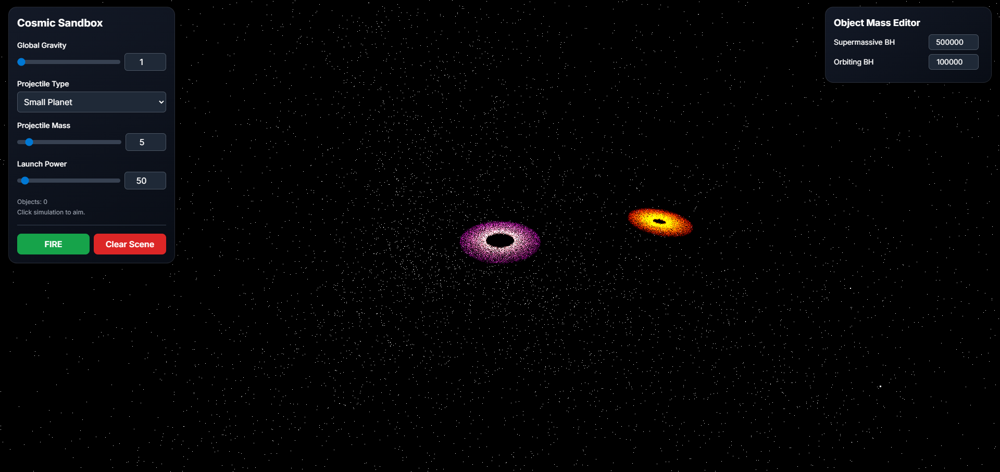
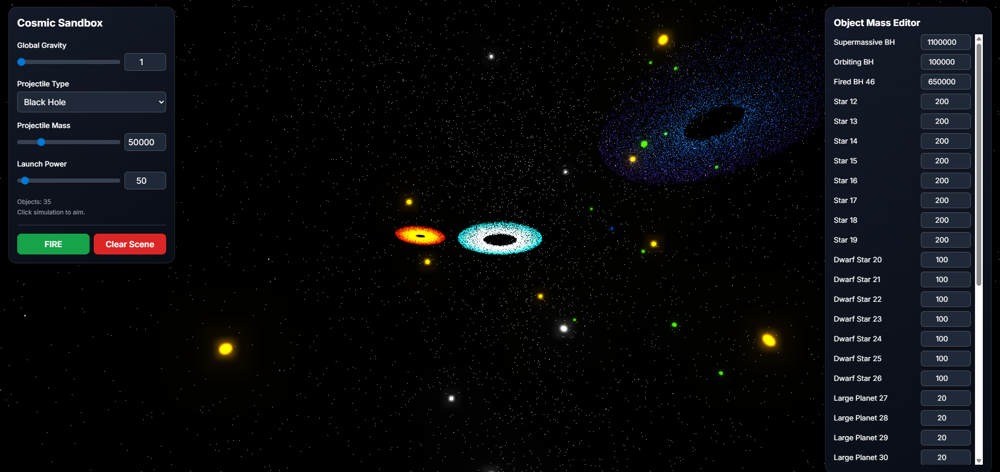

# BlackHoleSimulatorGame 🚀🕳️

Welcome to **BlackHoleSimulatorGame** – the only place where launching planets into black holes is not only encouraged, it's the *whole point*! 🌌

Ever wanted to see what happens when you hurl a star at a supermassive black hole? Or maybe you just want to create cosmic chaos from the comfort of your browser? You're in the right universe. (Warning: May cause uncontrollable giggling and/or existential dread.)


## 🚀 See It In Action!

Why read when you can *launch*? Try the game instantly (no install, no strings attached, just pure gravitational mayhem):

👉 **[Play BlackHoleSimulatorGame on GitHub Pages!](https://rorrimaesu.github.io/BlackHoleSimulatorGame/)** 👈


## 🌠 Dazzling Demo Screenshots

Still not convinced? Feast your eyes on these 100% real, totally un-Photoshopped screenshots from the game (no planets were harmed in the making of these images – probably):

<p align="center">
  
  
</p>


## ✨ Features

- 🚀 Launch planets, stars, and black holes (because why not?)
- 🧲 Realistic gravity physics and wild object interactions
- 🎥 Cinematic and aiming camera modes for your inner space director
- 📱 Mobile-friendly controls (on-screen joysticks and a big, satisfying FIRE button)
- ⚖️ Object mass editor – make your planets chunky or feather-light
- 💫 Accretion disks and starfield backgrounds for that authentic space vibe
- 🖌️ Responsive UI with Tailwind CSS (it even looks good on your phone!)


## 🖥️ How to Play Locally (for the DIY Astronaut)

1. Clone this cosmic sandbox to your computer:
   ```sh
   git clone https://github.com/RorriMaesu/BlackHoleSimulatorGame.git
   ```
2. Open `index.html` in your favorite browser (Chrome, Firefox, Edge, or whatever you use to procrastinate).

Or just [play online](https://rorrimaesu.github.io/BlackHoleSimulatorGame/) and save yourself the trouble (and the light-years of download time)!


## 🎮 Controls

**Desktop Astronauts:**
- Click the simulation to aim (pew pew!)
- WASD to move your cosmic cannon
- Mouse to aim
- Click to fire celestial objects into the void
- Use sliders and selectors to adjust gravity, power, and projectile type (yes, you can launch black holes)

**Mobile Space Cadets:**
- Use on-screen joysticks to move and aim
- Tap the giant "FIRE" button to launch (satisfaction guaranteed)


## 🛠️ Technologies Used
- [Three.js](https://threejs.org/) for 3D rendering (space never looked so good)
- [Tailwind CSS](https://tailwindcss.com/) for UI styling (because astronauts deserve nice buttons)
- Vanilla JavaScript for game logic (no frameworks, just pure cosmic code)


## ☕ Support the Developer

Like launching planets into oblivion? Buy me a coffee and help fuel more cosmic chaos!

<p align="center">
  <a href="https://buymeacoffee.com/rorrimaesu" target="_blank">
    
  </a>
</p>

## 🪐 License
MIT – because the universe should be free (and so should this code).


---
Created by [RorriMaesu](https://github.com/RorriMaesu) – who definitely hasn't been sucked into a black hole (yet).

## TL;DR: Just Play Already!

Why are you still reading? Go launch some planets: [https://rorrimaesu.github.io/BlackHoleSimulatorGame/](https://rorrimaesu.github.io/BlackHoleSimulatorGame/)

May your orbits be stable, your singularities stylish, and your coffee always strong!
